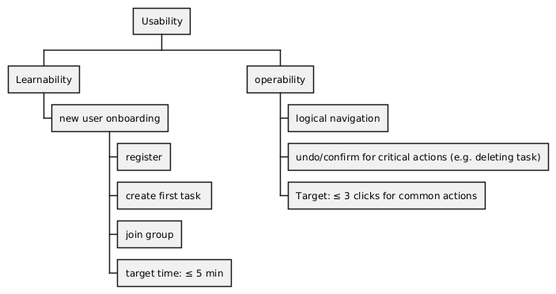
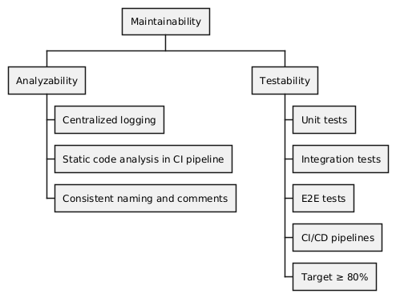

# Quality model

After some discussions, we agreed on the following four quality attributes of ISO 25010 that are the most important ones for our StudyConnect project.
- functional suitability
- usability
- maintainability
- performance efficiency

The most important quality attribute is functional suitability. This includes functional completeness as well as functional correctness of the required functions of StudyConnect.

Another important aspect is usability, to be able to achieve specific goals in an effective and efficient manner. Part of this is learnability, so that the user can quickly get used to the layout and processes of our StudyConnect app. It is also important that the most relevant functions can be accessed quickly and intuitively.

To ensure the performance of StudyConnect we decided to include performance efficiency as a criteria. This implies time-related behaviour like loading times and duration of certain operations as well as the appropriate use of system resources.

The last attribute is maintainability with its sub characteristics analyzability and testability. The former to make it easier to identify the causes of failures and the latter to guarantee that the implemented features can be verified through (automated) testing.

# Measures for testability
One can implement several measures to guarantee testability during the development of StudyConnect.

The first and most important one is automated testing: With an automated CI pipeline and the use of different testing strategies (unit tests, integration tests, E2E tests) one can ensure that each commit will be checked on its impact on the basic functions of StudyConnect.

A modular architecture will be adopted separating interfaces, logic and data layers to enable isolated unit testing.
To ensure reproducibility, a dedicated test environment will be used.

Furthermore, structured logging as well as the use of naming conventions and coding guidelines will improve testability by making it easier to trace errors.

These measures can ensure that test criteria can be defined clearly and that tests can be executed effectively and efficiently.
